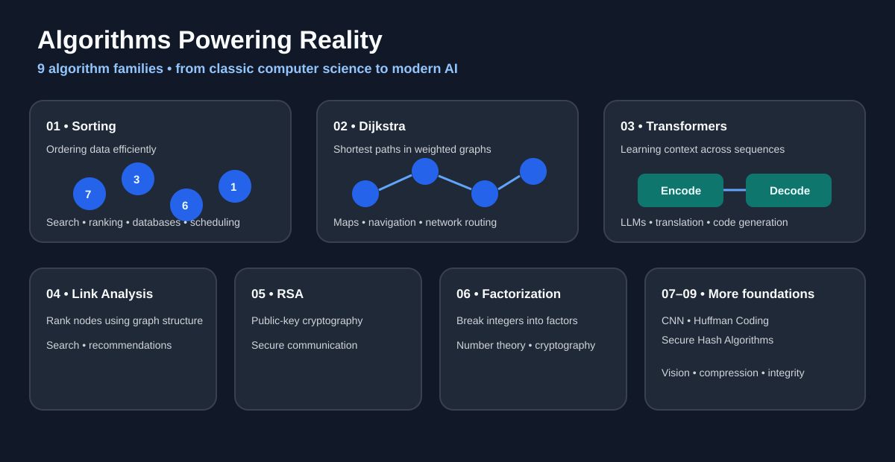

# Algorithms Powering Reality

> A practical, code-first journey through **9 algorithms that quietly power modern software, the internet, security, search, AI, and everyday technology.**



This repository is a learning project built to understand important algorithms **from first principles**, implement them in code, and connect the theory to systems we actually use.

The goal is not just to memorize algorithms.

The goal is to answer:

- **How does the algorithm work?**
- **Why was it invented?**
- **What problem does it solve?**
- **What is its time/space complexity?**
- **Where does the same idea appear in real systems?**
- **How can I implement it cleanly from scratch?**

---

## 🧭 The 9 Algorithms

| # | Algorithm | Core idea | Real-world connection | Status |
|---|---|---|---|---|
| 1 | **Sorting** | Order data efficiently | Databases, search, scheduling, ranking | 🚧 In progress |
| 2 | **Dijkstra's Algorithm** | Shortest paths in weighted graphs | Maps, routing, network paths | ⏳ Planned |
| 3 | **Transformers** | Learn relationships/context in sequences | LLMs, translation, code generation | ⏳ Planned |
| 4 | **Link Analysis** | Rank nodes using graph structure | Search engines, recommendation, networks | ⏳ Planned |
| 5 | **RSA** | Public-key cryptography | Secure communication and digital signatures | ⏳ Planned |
| 6 | **Integer Factorization** | Decompose integers into factors | Number theory and cryptographic foundations | ⏳ Planned |
| 7 | **Convolutional Neural Networks** | Learn spatial features | Image recognition and computer vision | ⏳ Planned |
| 8 | **Huffman Coding** | Variable-length lossless compression | File, image, audio and document compression | ⏳ Planned |
| 9 | **Secure Hash Algorithms** | Map data to fixed-size digests | File integrity, authentication, security systems | ⏳ Planned |

> **Note:** The repository will grow one algorithm at a time. Each section will eventually contain an explanation, implementation, complexity analysis, examples, and practical applications.

---

# 1. Sorting

Sorting is one of the fundamental building blocks of computer science.

At first, sorting looks simple: take some numbers and put them in order.

But efficient sorting becomes extremely important when the input grows to thousands, millions, or billions of records. Many other algorithms also become easier or faster after data has been sorted.

### Why learn sorting?

Sorting teaches several ideas that appear everywhere in algorithms:

- comparing elements
- swapping or moving data
- divide-and-conquer
- recursion
- choosing between time and memory
- recognizing best/worst-case behaviour
- exploiting already sorted structure

### Where is sorting useful?

Sorting appears in systems involving:

- search and indexing
- ranking results
- scheduling
- databases
- log processing
- analytics
- interval problems
- duplicate detection
- greedy algorithms
- preparing data for binary search

### Implementations in this repository

The first sorting module contains:

| Algorithm | Average Time | Worst Time | Extra Space | Main idea |
|---|---:|---:|---:|---|
| Bubble Sort | O(n²) | O(n²) | O(1) | Repeatedly swap adjacent out-of-order elements |
| Selection Sort | O(n²) | O(n²) | O(1) | Repeatedly select the minimum element |
| Insertion Sort | O(n²) | O(n²) | O(1) | Insert each element into the already-sorted prefix |
| Merge Sort | O(n log n) | O(n log n) | O(n) | Divide, sort halves, then merge |
| Quick Sort | O(n log n) | O(n²) | O(log n) average stack | Partition around a pivot |

## Repository structure

```text
algorithms-powering-reality/
│
├── assets/
│   └── algorithms-overview.svg
│
├── algorithms/
│   └── sorting/
│       ├── BubbleSort.java
│       ├── InsertionSort.java
│       ├── MergeSort.java
│       ├── QuickSort.java
│       ├── SelectionSort.java
│       └── README.md
│
├── LICENSE
└── README.md
```

---

## 📚 How this repository is meant to be used

Each algorithm should be studied in this order:

```text
Problem
   ↓
Intuition
   ↓
Example
   ↓
Algorithm
   ↓
Implementation
   ↓
Complexity
   ↓
Real-world use
   ↓
Practice
```

This makes the repository useful both as a learning notebook and as a quick revision reference.

---

## 🎯 Learning philosophy

A good algorithm implementation should not be treated as a black box.

For every algorithm added here, the focus will be on understanding:

**Input → decisions → state changes → output**

The code should be readable enough that someone learning the algorithm can trace what happens step by step.

---

## 🗺️ Roadmap

### Phase 1 — Foundations
- [x] Sorting
- [ ] Dijkstra's Algorithm

### Phase 2 — Web, Graphs & Security
- [ ] Link Analysis
- [ ] RSA
- [ ] Integer Factorization
- [ ] Secure Hash Algorithms
- [ ] Huffman Coding

### Phase 3 — Modern AI
- [ ] Convolutional Neural Networks
- [ ] Transformers

---

## 🤝 Contributing

This is primarily a learning repository, but improvements are welcome.

Useful contributions include:

- clearer explanations
- better examples
- edge-case tests
- alternative implementations
- complexity corrections
- visualizations
- real-world references

---

## ⭐ Why this repository exists

Modern software can feel like magic when we only look at the final product.

Algorithms make that magic understandable.

This repository is an attempt to connect classic computer science ideas with the systems that surround us every day.

**Learn the algorithm → understand the trade-off → see it in the real world → implement it yourself.**

---

### Progress

The repository is intentionally being built incrementally.  
**Sorting is the first module. More algorithms will be added next.**
